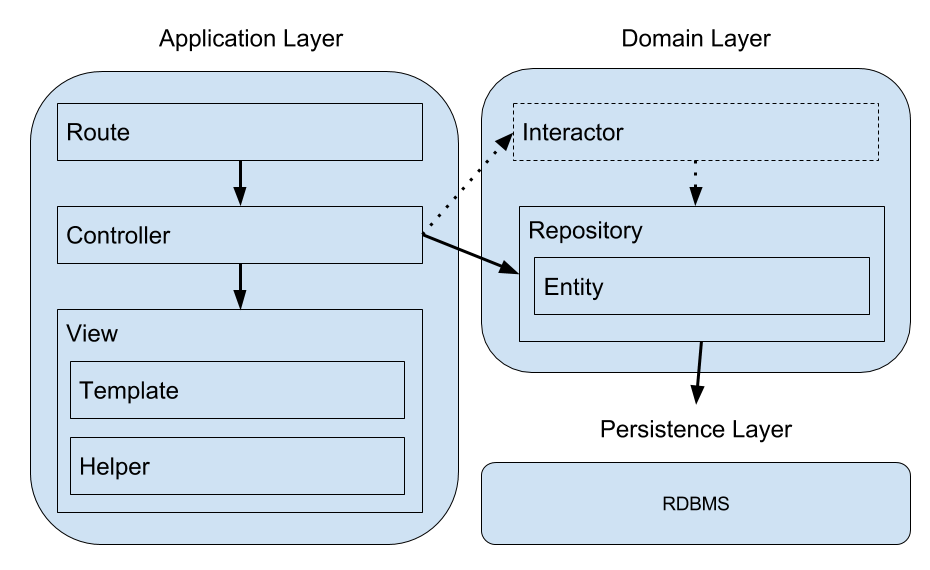
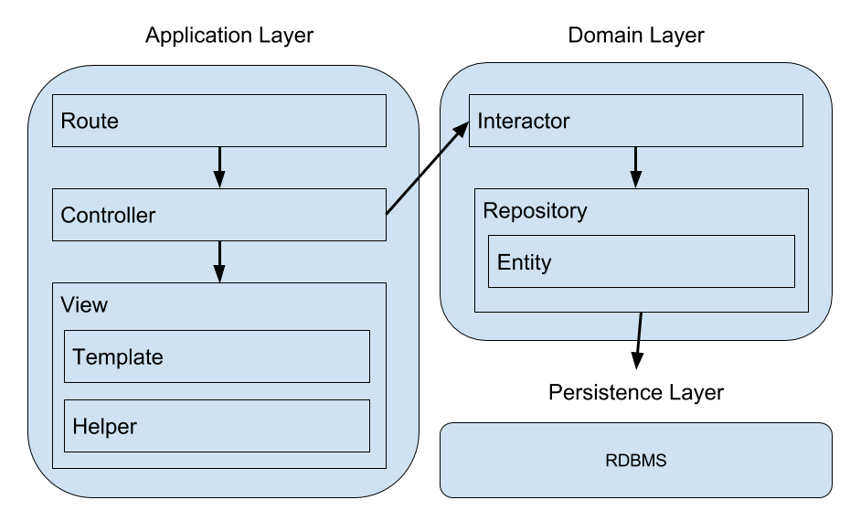

# HanamiはRubyの救世主(メシア)となるか、愚かな星と散るのか

## はじめに: レイルズ王国と異端審問

20XX年、僕は Ruby on Rails の規約に違反したコードを書いたことでレイルズ王国の異端審問にかけられていた。僕がリポジトリに commit した `app/services/` や `app/repositories/` といったディレクトリと、その中に定義された [Command パターン](https://ja.wikipedia.org/wiki/Command_%E3%83%91%E3%82%BF%E3%83%BC%E3%83%B3)を用いたクラスや `Module#refine` による [DCI](http://www.artima.com/articles/dci_vision.html) もどき達がレイルズ王国の異端審問官の目に触れてしまったのだ。(僕は ActiveRecord で作られた Model の特異クラスに対して Module#refine を用いて SQL の発行を行うメソッドを差し込むという方法で Repository を表現していた。)

異端審問官は旨に掲げた聖書(Rails Guideという名前だった)を僕の頭に振り降りしながら叫んだ。

「この `app/services/` や `app/repositories/` というディレクトリは聖書に記されていない！
規約に違反しています！ このようなコードは開発者を困惑させ、スケジュールの遅延に繋がるのです！」

「いいえ、審問官様！これらの設計はメンテナンス性を上げるために尽力した結果なのです！
この設計はシステムの長期運用に有用です！いたずらにレールを外れたわけではないのです！」

「規約が全てなのです！レールに乗るのです！」

僕は異端審問の結果、国外追放になってしまった。
ルビィ島の大半はレイルズ王国に支配されていたが、そうではない場所もあった。
僕は自生したラックの実を齧りながらさまよった末、小さな村にたどり着いた。

村の人々は異国の服を着ていたり、大きかったり小さかったり、若かったり老いていたりしていた。
そして、桜の樹の下で、静かに花見をしていた…

## Hanami について

まぁ、茶番はこのくらいにして。これは Hanami の紹介記事だ。

[Hanami](http://hanamirb.org/) は Ruby 製の新しい Web フレームワークだ。2017年4月の桜前線に合わせてバージョン 1.0.0 がリリースされた。でも、（少なくとも）日本ではいまいち注目されていないように感じる。
Hanami はとても面白い Web フレームワークだ。簡単に言うと「Rails がもっとこうだったらいいのになぁ」と僕が思うようなことを全部やってくれた。
バージョン 1.0.0 だから機能として不十分な部分もあるけれど、それを踏まえてもワクワクするフレームワークだ。

「まだRubyを使うの？ 新しく何かを学ぶなら Go とか Elixir とかの方がいいんじゃないの？」

それも尤もな意見だ。いや、でもそう言わないでくれ。

Hanami は本当に面白い Web フレームワークだ。
それに [dry-rb](http://dry-rb.org/) や [ROM.rb](http://rom-rb.org/) のような新しいタイプの gem も使っている。
一方で、 [Rack](http://rack.github.io/) や [Sequel](http://sequel.jeremyevans.net/) や [Shotgun](https://github.com/rtomayko/shotgun) のような昔からある gem もうまく使っている。

Hanami を使えばきっと Rails とは違う目線で Ruby を見ることができると思う。

本記事の読者は今まで Rails を使ってWebサービスを作ってきた人を想定している。
本記事では Hanami と Rails の比較を頻繁にするが、これは Rails を使ってきた人に Hanami を紹介するためには一番いい方法だと思うからだ。
はじめに断っておくが、僕は Rails の批判をしたいわけじゃない。

### Hanami は Rails じゃない

Hanami の紹介をするにあたり、まず重要なこととして一言:  Hanami は Rails じゃない。
つまり、 Hanami も Rails も Ruby 製の Web フレームワークだけど、使用目的や設計思想や得意な分野が違う。

Rails は MVC (これが何かについて今は話したくない) や ActiveRecord パターンをベースにした設計だが、
Hanami は [DDD (Domain-driven design)](https://www.amazon.co.jp/dp/B00GRKD6XU) をベースにしている。
Rails はサービスを素早くローンチすることに向いていて、 Hanami は長期的にメンテナンスすることに向いている。

Hanami のコンセプトは次の4つだ。

- Modularity (継承ではなく Module と mix-in を積極的に使う)
- Simplicity and LightWeight
- Pure Object (Zero Monkey-Patching)
- Threadsafe

Hanami は Rails と同じく Routing から DB へのアクセスまで Web サービスとしての全ての機能を提供する Web フレームワークだけど、
Rails よりもずっとマジックが少なくて Pure Ruby に近い。

Rails は Monkey-Patching で Ruby を拡張している。メソッドを使おうとしたときにそれが Ruby の標準ライブラリのメソッドなのか Rails が独自に拡張したメソッドなのかよくわからなくなる。
Hanami ではそのようなことはしない。
これはもちろん長所短所がある。Railsのように拡張した方が便利だけど、Hanamiはそれ以上にシンプルであることを選択した。

### Hanami の設計思想

Hanami の設計思想は DDD の影響が強い。
ディレクトリ構造にもこれは現れている。

Hanami にも Rails と同様に generator 機能があるので次のコマンドで、新しい Hanami プロジェクトを作ってみよう。

```
% gem install hanami
% hanami new bookshelf
% tree -F bookshelf
bookshelf
├── Gemfile
├── Rakefile
├── apps/
│   └── web/
│       ├── application.rb
│       ├── assets/
│       │   ├── favicon.ico
│       │   ├── images/
│       │   ├── javascripts/
│       │   └── stylesheets/
│       ├── config/
│       │   └── routes.rb
│       ├── controllers/
│       ├── templates/
│       │   └── application.html.erb
│       └── views/
│           └── application_layout.rb
├── config/
│   ├── boot.rb
│   ├── environment.rb
│   └── initializers/
├── config.ru
├── db/
│   ├── migrations/
│   └── schema.sql
├── lib/
│   ├── bookshelf/
│   │   ├── entities/
│   │   ├── mailers/
│   │   │   └── templates/
│   │   └── repositories/
│   └── bookshelf.rb
├── public/
└── spec/
    ├── bookshelf/
    │   ├── entities/
    │   ├── mailers/
    │   └── repositories/
    ├── features_helper.rb
    ├── spec_helper.rb
    ├── support/
    └── web/
        ├── controllers/
        ├── features/
        └── views/

31 directories, 14 files
```

Hanami のディレクトリ構造は一見 Rails に似ているが、実際には全く違う。

大雑把に言うとデータフローに関する部分は `apps/` 以下に、 ビジネスロジックに関する部分は `lib/` 以下に定義する。
`apps/` 以下には Routing 、 Controller 、 View 、 Assets に関するもの、 `lib/` 以下には Model と Integrator に関するものを置く。
図にすると次のようになる。



Hanami では Model を Repository と Entity の2層で表現している。

図中の "Integrator" の部分が点線になっているが、これは Hanami では Integrator の実装がまだ不十分だからだ。
Integrator とは Controller と Model の間にあって、ビジネスロジックをまとめておくための層になる。

`apps/` 以下にはアプリケーションとして複数のディレクトリを定義することができる。
例えば、ECサイトを作るときにWebサービスを顧客(Customer)向け、店舗(Shop)向け、管理者(Admin)向けに分けたい場合、次のようなディレクトリ構成にすればいい。

```
apps/
├── customers/
├── shops/
└── admins/
```

`lib/` 以下にあるビジネスロジックに関する部分は `apps/` 以下で共通して使えるが、
`apps/` にあるデータフローに関する部分は名前空間で分けることができる。

## Hanami の各層について

Hanami の各層についてひとつずつ見ていこう。

### Router

Hanami は Rack Application だ。 Hanami::Router はパスを Rack Application にマッピングする。

一番無骨な例はこうだ。

```ruby
# apps/web/config/routes.rb
get '/hello', to: ->(env) { [200, {}, ['Hello from Hanami!']] }
```

[Rackのドキュメント](http://www.rubydoc.info/github/rack/rack/file/SPEC) では Rack Application の仕様について次のように記されている。

> A Rack application is a Ruby object (not a class) that responds to call. It takes exactly one argument, the environment and returns an Array of exactly three values: The status, the headers, and the body.

つまり、

- `#call` メソッドをもったオブジェクト
- `#call` メソッドは `environment` を引数にとる
- `#call` メソッドは要素数が3の配列を返し、配列の値は前から順に Status 、Headers 、Body であること

先程のプログラムはこの Rack Application の仕様を満たしている。
結果として、 Hanami::Router は `/hello` に GET リクエストを受け取ると `Hello from Hanami!` と返すわけだ。

Hanami::Router は Rack Application であれば何でもマッピングできるため、他にも次のような書き方ができる。

```ruby
get '/proc',       to: ->(env) { [200, {}, ['Hello from Hanami!']] }
get '/action',     to: "home#index"
get '/middleware', to: Middleware
get '/rack-app',   to: RackApp.new
get '/rails',      to: ActionControllerSubclass.action(:new)
```

一番使うのは2番めの `get '/action', to: "home#index"` という書き方だろう。
これは HTTP リクエストを `home#index` Action にマッピングする。Action (Controller) については次節で説明する。

また、Rails 同様 `resources` メソッドを用いることで RESTfull Resource を定義できる。

```ruby
resources :books
```

```
% hanami routes
                Name Method     Path                           Action

               books GET, HEAD  /books                         Web::Controllers::Books::Index
            new_book GET, HEAD  /books/new                     Web::Controllers::Books::New
               books POST       /books                         Web::Controllers::Books::Create
                book GET, HEAD  /books/:id                     Web::Controllers::Books::Show
           edit_book GET, HEAD  /books/:id/edit                Web::Controllers::Books::Edit
                book PATCH      /books/:id                     Web::Controllers::Books::Update
                book DELETE     /books/:id                     Web::Controllers::Books::Destroy
```

#### Router の高度な使い方

Hanami::Router はパスを正規表現やワイルドカードでマッチさせる便利な機能が備わっている。
これについては公式サイトのドキュメントを見てほしい。

- [Hanami | Guides - Basic Usage](http://hanamirb.org/guides/routing/basic-usage/)

でも、Hanami::Router が単に Rack Application にマッピングするだけということは、もっと柔軟なマッピングもできる。
例えば、 root パスにアクセスしたときにユーザーがサインインしているかどうかによってアクションを変えるケースを考えてみよう。
下記の例では、サインインしている場合 `env['rack.session']['user_id']` に値があるものとする。

```ruby
get '/', to: ->(env) {
  if env['rack.session']['user_id']
    # サインイン状態であれば home#index
    Web::Controllers::Home::Index.new.call(env)
  else
    # サインイン状態でなければ session#new
    Web::Controllers::Session::New.new.call(env)
  end
}
```

Rails の場合、 [Constraint クラス](http://guides.rubyonrails.org/routing.html#advanced-constraints) を定義すると
同じようなことができるけど、 Hanami の方がコンパクトに実装できているように思う。

### Controller

Router の話で予想がついたかもしれないけど、 Controller は Rack Application として実装する。

一番単純な例だとこんな感じだ:

```ruby
# apps/web/controllers/dashboard/index.rb
module Web::Controllers::Dashboard
  class Index
    include Web::Action

    def call(params)
    end
  end
end
```

短いコードだけど、上から読んでいこう。

まず、 Hanami では Controller は Action 毎にクラスを作成する。
上記は `Index` の Action だけど、 別の例だと `new` の Action は `Web::Controllers::Dashboard::New` になる。

次に、 `Web::Action` を `include` している。
これは [hanami-controller gem](https://github.com/hanami/controller) で定義された `Hanami::Action` を少し拡張した module だ。
この `Web::` という名前空間は `apps/web/` ディレクトリ以下に対応した名前空間だから、`Web::Action` はこの名前空間における Action の基底 module だ。
もちろん `Hanami::Action` をそのまま使ってもいいんだけど、名前空間に対応した基底 module があったほうが便利なので `Web::Action` を
使うほうがいい。

最後に、 `#call` メソッドを定義している。
これは Rack Application の `#call` に近い動きをするけど、 `Hanami::Action` のおかげで便利になっている。
Rack Application は `#call` の引数に `environment` を取るけど、このコードでは `params` を取ることになっている。
これは `Hanami::Action` と `Hanami::Router` がうまい具合に `environment` から `params` だけ取り出して `#call` の引数に入れてくれているんだ。
だから Action 内では `environment` を直接見る必要がない。(Session 等の利用方法については http://hanamirb.org/guides/actions/sessions/ を参照)

これは単にコードがスッキリするだけじゃなくて、別のメリットもある。それはテストを書きやすいことだ。
`Web::Controllers::Dashboard::Index` のテストは次のようになる。

```ruby
# spec/web/controllers/dashboard/index_spec.rb
require 'spec_helper'
require_relative '../../../../apps/web/controllers/dashboard/index'

describe Web::Controllers::Dashboard::Index do
  let(:action) { Web::Controllers::Dashboard::Index.new }
  let(:params) { Hash[] }

  it "is successful" do
    response = action.call(params)

    response[0].must_equal 200 # http status code
    response[1] #=> http header [Hash]
    response[2] #=> http body [String]
  end
end
```

`Web::Controllers::Dashboard::Index` はただのクラスだから当然インスタンスを作ることができる。
そして、テストしたいメソッドは `#call` だからこれを呼び出す。`#call` の引数の `params` は `Hash` で任意に作って渡してやればいい。
`#call` は Rack Application の規約に則って要素数3の配列を返すから、この値をテストする。

もちろん [Rack::Test](https://github.com/rack-test/rack-test) を使うこともできるけど、
上記のように入力値と戻り値を確認するだけで十分なケースは多い。
それにこれはただのメソッド呼び出しだから Rack::Test を使うよりも実行速度が速い。

### Validation

Hanami の Controller にはもう一つ機能があって、入力された `params` の Validation を定義することができる。

```ruby
# apps/web/controllers/users/create.rb
module Web::Controllers::Users
  class Create
    include Web::Action

    params do
      required(:user).schema do
        required(:email).value(:filled?)
        required(:password).value(:filled?, size?: 8..40, format?: /\A[\w!$%@#123]+\z/).confirmation
        required(:password_confirmation).filled(:str?)
      end
    end

    def call(params)
      if params.valid?
        # Validation に成功した時の処理
      else
        # Validation に失敗した時の処理
      end
    end
  end
end
```

上記の例では `params` に次のような値が入力されることを期待している。

```ruby
params = {
  user: {
    email: 'user1@example.com',
    password: 'password',
    password_confirmation: 'password'
  }
}
```

Hanami の Validation に関する部分は [hanami-validations](https://github.com/hanami/validations) という gem にまとまっている。
この gem は [dry-validation](http://dry-rb.org/gems/dry-validation/) をベースにしていて、 AcriveRecord の Validation と
同じくらい細かくルールを記述できる。

hanami-validations の細かい使い方は gem の [README](https://github.com/hanami/validations) 等を参照してほしい。
ここではアーキテクチャ設計に関する話をしよう。

Rails と比べると、 Model ではなく Controller に Validation があるのは違和感があるかもしれない。
でも Validation の目的は入力値の妥当性を検証することだ。
Web サービスの入力は Form や API リクエストで渡されてくるから、 Routes から Controller に渡されることになる。
Model はデータベース寄りの層だから、入力値の妥当性を検証するなら Controller にある方がいい。

Model に Validation を書く設計では、例えば新規作成と更新で Validation が異なるような場合に定義しづらい。
また、入力パラメータが複数の Model に影響を与える場合の Validation も書きづらい。
(僕は Rails の `accepts_nested_attributes_for` や `validates` メソッドの `if` 、`unless` 、 `on` オプションがものすごく嫌いだ。)

それに Rails も入力値を制限するということを Controller でも行なっている。 Strong Parameters だ。
Strong Parameters の目的は Mass Assignment 脆弱性対策だけど、それはつまり Controller に入力可能な項目を定義するという意味もある。
結果的に、 Rails では Action に対する入力値を Controller で定義して、 Model で Validation を実行するという設計になっている。
これはロジックが分散してわかりづらいし、層を跨いで暗黙の依存関係があるような感じがして気持ち悪い。

Hanami は Controller にロジックをまとめる設計になっている。
だがこれはこれで思い切った割り切りをしているので課題がある。課題については Integrator の節で説明する。

### View

Hanami の View は HTML Template と Ruby のクラスで構成されている。
Rails でいえば、 View や Partial にそれぞれクラスがあるような感じだ。

例えば、 `dashboard#index` アクションの HTML Template は

```html
<!-- apps/web/templates/dashboard/index.html.erb -->
<h1><%= title %></h1>
```

のような erb ファイルになる。これと1対1に対応する Ruby のクラスは次にようになる。

```ruby
# apps/web/views/dashboard/index.rb
module Web::Views::Dashboard
  class Index
    include Web::View

    def title
      'Dashboard'
    end
  end
end
```

ディレクトリ構成は

```
apps/web/
├── templates
│   ├── application.html.erb
│   └── dashboard
│        └── index.html.erb
└── views
    ├── application_layout.rb
    └── dashboard
         └── index.rb
```

のようになる。Template と View は、パスで1対1に対応している。

HTML Template は erb 以外にも [tilt](https://github.com/rtomayko/tilt) で扱えるエンジンが使用できるため、 Haml や Slim 等も使うことができる。

View 用のクラスに定義したメソッドは HTML Template から呼び出すことができる。
HTML Template から呼び出すことができるメソッドは1対1対応しているクラスで定義したものだけなので、
それ以外のクラスのメソッドを呼び出そうとした場合は No Method Error になる。

Rails では View のためのロジックを定義するには Helper モジュールを使うしかなかった。
Rails の Helper モジュールはデフォルトでは全て読み込まれるが、設定を変更すればパスに対応した Helper だけを読み込むことができる。
しかしこれも Controller 単位で、 Template ファイル単位ではない。
どれだけ partial で Template を分割しても、使用できる Helper モジュールは Controller の粒度で決まるため、いまいち使い勝手が悪い。

[draper](https://github.com/drapergem/draper) や [ActiveDecorator](https://github.com/amatsuda/active_decorator) のように
Model の decorator を作成して View 用のロジックを記述する gem もあるが、これらは Dependency Injection するオブジェクトを
拡張するものなので Template とは無関係だから Controller の複雑さは解消しない。

Hanami のように Template と Ruby のクラスが1対1に対応することで、ほとんど全てのViewのためのロジックを
Templateから追い出すことができるようになる。

#### Helper, Form

Hanami の Helper メソッドは View クラスで使う前提で出来ている。
これもまたロジックを Template から追い出しやすくしている。

例えば、 Ruby のコードの中で HTML の生成がやりやすい。

```ruby
module Web::Views::Dashboard
  class Index
    include Web::View

    def title
      html.div(class: 'header-background') do
        div(class: 'header') do
          h1(class: 'title') do
           'Dashboard'
          end
        end
      end
    end
  end
end
```

上記の `title` メソッドは次の HTML を返す。

```html
<div class="header-background">
  <div class="header">
    <h1 class="title">Dashboard</h1>
  </div>
</div>
```

Rails の Helper では HTML の生成は `content_tag` メソッドで行うことができるが、冗長になりがちだったため
Helper や プレゼンテーション([draper](https://github.com/drapergem/draper)等で作成した)で
HTMLを返すメソッドを定義しづらかった。
Hanamiの場合、HTMLを返すメソッドを定義しやすいので、ロジックをよりRubyのクラスにまとめやすくなる。

また、 Form も同様に定義しやすくなっている。

```ruby
def form
  form_for :book, routes.books_path do
    text_field :title

    submit 'Create'
  end
end
```

これは次のHTMLを返す。

```html
<form action="/books" id="book-form" method="POST">
  <input type="hidden" name="_csrf_token" value="0a800d6a8fc3c24e7eca319186beb287689a91c2a719f1cbb411f721cacd79d4">
  <input type="text" name="book[title]" id="book-id" value="">
  <button type="submit">Create</button>
</form>
```

Hanami の `form_for` は Rails 5.1 で追加された `form_with` に近い動きをする。
これらはフォームを生成するためにオブジェクトを必要としない。

Rails の `form_for` で親しまれてきた Model のインスタンスを用いてフォームを作成する手法は、
エラーメッセージの出し分けや多言語対応に関してはオブジェクト指向をうまく使っていてスマートだが、
ネストしたフォームを作るケースなどを考えるとフォーム生成時に行わなければならない手続きが多く、面倒が増えるという面もある。

これを避けるため、HTML中のフォームの作成にはオブジェクトを使用しない設計にし、
HTMLの生成とリクエストを受ける側のアクションが依存しないようになった。

### Model


今までずっとアプリケーション層を巡る旅をしてきた。ここからはドメイン層を見ていこう。
ドメイン層には Integrator 、Repository 、 Entity の3があるが、 Repository 、 Entity の2で Model を表現している。
これは [Repository パターン](https://martinfowler.com/eaaCatalog/repository.html) と呼ばれている設計手法だ。

Entity の方がわかりやすいので、まずはこちらから見ていこう。

### Entity

Entity は RDBMS のテーブルを Ruby で表現するためのだ。
（実際には RDBMS 以外も扱うことができるが、ここでは話を単純にするため RDBMS に限定して説明する）
ActiveRecord と同様にクラスがテーブル、オブジェクトがレコードに対応する。
しかし ActiveRecord と異なり、 Entity は RDBMS のデータをオブジェクトとして扱うための入れ物に過ぎず、
SQL の発行等の RDBMS に対する操作は Repository で行う。

Entity はイミュータブルで、イニシャライザでしか値を入力することが出来ない。

```ruby
class User < Hanami::Entity
  # データベースの users テーブルに email カラムが存在する
end

user = User.new(email: 'kbaba1001@example.com')
user.email
#=> "kbaba1001@example.com"
user.email = 'foo@example.com'
#=> NoMethodError: undefined method `email='
```

Entity の仕事はほとんどこれだけだ。

### Repository

Repository は SQL を発行して、 Entity の CRUD 操作を行う。
システム内で SQL を発行する部分を Repository だけにすることで抽象度を揃えることができる。

Repository は次のように `Hanami::Repository` を継承して作成する。

```ruby
class UserRepository < Hanami::Repository
end
```

`Hanami::Repository` には次の public メソッドがインタフェースとして提供されている。

- `#create(data)` - `data` から RDBMS のレコードを作成して Entity のオブジェクトを返す
- `#update(id, data)` - `id` のレコードを `data` で更新して Entity のオブジェクトを返す
- `#delete(id)` - `id` のレコードを削除する
- `#all` - テーブルから全てのレコードを取得して Entity の配列で返す
- `#find(id)` - `id` のレコードを取得して Entity のオブジェクトを返す
- `#first` - テーブルから最初のレコードを取得して Entity のオブジェクトを返す。並び順はデフォルトでは id の昇順。
- `#last` - テーブルから最後のレコードを取得して Entity のオブジェクトを返す。並び順はデフォルトでは id の昇順。
- `#clear` - テーブルの全てのレコードを削除する

これ以外の操作については自らメソッドを定義する。

```ruby
class UserRepository < Hanami::Repository
  def find_by_email(email)
    users.where(email: email).first
  end
end
```

この時、次のようにすることでメソッドを定義することなく SQL を発行することができるが、 Hanami では推奨されていない。

```ruby
user_repository = UserRepository.new

user_repository.users.where(email: email).first
```

次の理由がある。

- 呼び出す側が Repository の内部構造に依存している
- 呼び出す側がSQLについて考えてしまうと、レイヤー間の抽象度が揃わなくなる
- ただのメソッドチェーンでは意図が明白ではない
- テストしづらい
- もしストレージ(RDBMS)を変更することになったら、呼び出す側を変更しなければならない

ソフトウェア設計の抽象度とは、あるオブジェクトが他のオブジェクトのことをどの程度知っているかという度合いのことだ。
SQLの発行に関するコードを Repository 内に隠蔽できれば、 Repository を呼び出す側は SQL について考える必要はなくなり、
Repository のインタフェースだけを知っていれば良くなる。
Repository がシステム内の SQL 発行の責務を一任することで、SQLに関する修正や抽象化がやりやすくなる。
もし、ストレージ(RDBMS)を変更することになったとしても Repository と Entity を修正すればよいだけになる。

#### SQL の発行

`Hanami::Repository` の提供するテーブルへのアクセッサは `ROM::Relation::Composite` のインスタンスを返す。

```ruby
user_repository = UserRepository.new

user_repository.users
#=> #<ROM::Relation::Composite...>
```

これは Hanami の Model の実装が内部では [ROM.rb](http://rom-rb.org/) を使っているためだ。

ROM は Ruby Object Mapper の略で、 RDBMS 以外にも様々なもの(CSVやHTTPリソースなど)をデータストレージとして扱うことができる gem だ。
ROM における SQL の発行は [rom-sql](https://github.com/rom-rb/rom-sql) という gem で行なっていて、
これは [Sequel](https://github.com/jeremyevans/sequel) のラッパーになっている。
だから、 `Hanami::Repository` では Sequel の機能がだいたい使える。
こんな感じだ。

```ruby
users.where(email: 'kbaba1001@example.com')
users.where("email = 'kbaba1001@example.com'")
users.where(created_at: (Date.today - 14)..(Date.today - 7)) # WHERE ((\"created_at\" >= '2017-07-23') AND (\"created_at\" <= '2017-07-30'))
users.where { created_at > Date.today } # WHERE (created_at > '2017-08-13')
users.where(status: ['unconfirmed', 'confirmed']) # WHERE (status IN ('unconfirmed', 'confirmed'))
users.exclude(status: ['unconfirmed', 'confirmed']) # WHERE (status NOT IN ('unconfirmed', 'confirmed'))
users.where(Sequel.lit('id IS NOT NULL')) # WHERE (id IS NOT NULL)
users.where(Sequel.like(:email, '%kbaba1001%')) # WHERE ("email" LIKE '%kbaba1001%' ESCAPE '\')
```

Sequel は ORM として豊かな表現力を持っている。これにより様々なSQLを発行することができる。
詳しくは [Sequel の README](https://github.com/jeremyevans/sequel) を参照してほしい。

### Integrator

最後に Integrator の話をしよう。 Integrator は [Hanami - Guide](http://hanamirb.org/guides/) に登場しない。
しかし DDD の観点からすると非常に重要なレイヤーなので説明する。
Integrator の責務はビジネスロジックをまとめることだ。

まず、 Integrator を用いた場合のアーキテクチャ設計の概念図は次のようになる。



Integrator は Controller と Repository の中間に位置する。
Hanami では Integrator がない場合 Controller にビジネスロジックを書くことになる。
まずこのケースから見てみよう。

```ruby
module Web::Controllers::Users
  class Create
    include Web::Action

    expose :user

    params do
      required(:user).schema do
        required(:email).value(:filled?)
        required(:password).value(:filled?, size?: 8..40, format?: /\A[\w!$%@#123]+\z/).confirmation
        required(:password_confirmation).filled(:str?)
      end
    end

    def call(params)
      if params.valid?
        @user = sign_up_user

        redirect_to '/'
      else
        self.status = 422
      end
    end

    def sign_up_user
      password_digest = BCrypt::Password.hashing(params[:user][:password])

      UserRepository.new.create(
        email: params[:user][:email],
        password_digest: password_digest
      )
    end
  end
end
```

上記のコードでは、 Action は `params` の Validation に成功したら User 情報をデータベースに記録する。
これは次の点でビジネスロジックを含んでいる。

- パラメータの Validation
- 平文のパスワードを Hashing する
- User 情報をデータベースに記録する

Action の責務は HTTP リクエストにレスポンスを返すことなので、ビジネスロジックを記述することは [単一責任の原則(SRP)](https://en.wikipedia.org/wiki/Single_responsibility_principle) に違反している。
そのため、User を作成するロジックを他の場所で使いたい場合や、ここで使っているロジックを他の場所で流用したい場合、
Action にロジックがあると使いづらい。
そこで、 Integrator を導入することでこれらのビジネスロジックを Action から分離してみよう。

#### Hanami::Interactor

Interactor の作成単位にはいくつかの設計があるが、ここでは Entity 毎に作成する方法を紹介する。
Hanami における Integrator は実は [hanami-utils](https://github.com/hanami/utils) gem 内で [Hanami::Interactor](http://www.rubydoc.info/gems/hanami-utils/Hanami/Interactor/) として提供されている。

これを使ってみよう。

```ruby
# lib/bookshelf/interactors/user_interactor/create.rb
require 'hanami/interactor'

module UserInteractor
  class Create
    include Hanami::Interactor

    expose :user, :params

    def initialize(params)
      @params = params
    end

    def call
      password_digest = BCrypt::Password.hashing(@params[:user][:password])

      @user = UserRepository.new.create(
        email: @params[:user][:email],
        password_digest: password_digest
      )
    end

    private

    def valid?
      true
    end
  end
end

result = UserInteractor::Create.new(
  user: {
    email: 'kbaba1001@example.com',
    password: 'password',
    password_confirmation: 'password'
  }
).call #=> Hanami::Integrator::Result のインスタンスを返す

result.failure? #=> false
result.successful? #=> true

result.user #=> #<User:0x0055e9b1916608 ...>
result.params #=> {:email=>"kbaba1001@example.com", :password=>"password", :password_confirmation=>"password"}
result.foo #=> raises NoMethodError
```

`Hanami::Interactor` を include したクラスで `#call` を呼び出すと次のような特殊な動きをする。

- `#valid?` を実行する
- `#valid?` の戻り値が真値であれば、クラスに定義された `#call` を実行する
- (`#valid?` の戻り地が偽値であれば、何もしない)
- Hanami::Integrator::Result のインスタンスに `.expose` で指定したインスタンス変数を Dependency Injection する
- Hanami::Integrator::Result のインスタンスを返す

この動きにより、 `#call` には Validation をパスした時のみ実行するビジネスロジックを記述することができる。
`#valid?` には Validation の結果を呼び出すようなメソッドを定義すれば良い。
例えば、 `#valid?` を次に変更しよう。

```ruby
require 'hanami/interactor'

module UserInteractor
  class Create
    # ... (省略) ...

    def valid?
      @params.valid?
    end
  end
end
```

これを Controller から次のように使用する。

```ruby
module Web::Controllers::Users
  class Create
    include Web::Action

    expose :user

    params do
      required(:user).schema do
        required(:email).value(:filled?)
        required(:password).value(:filled?, size?: 8..40, format?: /\A[\w!$%@#123]+\z/).confirmation
        required(:password_confirmation).filled(:str?)
      end
    end

    def call(params)
      interactor = UserInteractor::Create.new(params).call

      if interactor.successful?
        @user = interactor.user

        redirect_to '/'
      else
        self.status = 422
      end
    end
  end
end
```

これにより、 User を生成する処理を Integrator に移動することが出来た。

しかしまだ Validation が Controller に残っている。
僕としては Integrator が受け入れ可能なパラメータと Validation も把握している方が好きだ。

今度は Validation を Integrator で扱えるようにしよう。

#### Hanami::Validations

Hanami における Validation は Controller に依存しておらず、 [hanami-validations](https://github.com/hanami/validations) gem で独立して提供されている。
これにより、 Controller とは無関係のクラスでも Validation を定義することができる。

```ruby
require 'hanami/validations'

class Validation
  include Hanami::Validations

  # NOTE 独自の Validation ルールを作成するためのメソッド
  predicate(:email?, message: "invalid email format") do |value|
    /\A\s*([^@\s]{1,64})@((?:[-\p{L}\d]+\.)+\p{L}{2,})\s*\z/i === value
  end

  validations do
    required(:email).value(:filled?, :email?)
    required(:password).value(:filled?, size?: 8..40, format?: /\A[\w!$%@#123]+\z/).confirmation
    required(:password_confirmation).filled(:str?)
  end
end

result = Validation.new(
  email: 'kbaba1001@example.com',
  password: 'password',
  password_confirmation: 'password'
).validate
result.success? #=> true
result.failure? #=> false

result = Validation.new(
  email: 'kbaba1001',
  password: 'password',
  password_confirmation: 'password'
).validate
result.success? #=> false
result.failure? #=> true
result.messages #=> {:email=>["invalid email format"]}
```

さて、これを Integrator 内で使ってみよう。

```ruby
# lib/bookshelf/interactors/user_integrator/create.rb
require 'hanami/interactor'
require 'hanami/validations'

module UserInteractor
  class Create
    class Validation
      include Hanami::Validations

      predicate(:email?, message: "invalid email format") do |value|
        /\A\s*([^@\s]{1,64})@((?:[-\p{L}\d]+\.)+\p{L}{2,})\s*\z/i === value
      end

      validations do
        required(:email).value(:filled?, :email?)
        required(:password).value(:filled?, size?: 8..40, format?: /\A[\w!$%@#123]+\z/).confirmation
        required(:password_confirmation).filled(:str?)
      end
    end

    include Hanami::Interactor

    expose :user, :params

    def initialize(params)
      @params = params
    end

    def call
      password_digest = BCrypt::Password.hashing(@params[:password])

      @user = UserRepository.new.create(
        email: @params[:email],
        password_digest: password_digest
      )
    end

    private

    def valid?
      @validate_result = Validation.new(@params).validate

      if @validate_result.failure?
        error(@validate_result.messages)
      end

      @validate_result.success?
    end
  end
end

result = UserInteractor::Create.new(
  email: 'kbaba1001@example.com',
  password: 'password',
  password_confirmation: 'password'
).call
result.successful? #=> true
result.error # => nil

result = UserInteractor::Create.new(
  email: 'kbaba1001',
  password: 'password',
  password_confirmation: 'password'
).call
result.successful? #=> false
result.error #=> {:email=>["invalid email format"]}
```

これを使う Controller は次のようになる。

```ruby
module Web::Controllers::Users
  class Create
    include Web::Action

    expose :user, :error

    def call(params)
      interactor = UserInteractor::Create.new(params).call

      if interactor.successful?
        @user = interactor.user

        redirect_to '/'
      else
        @error = interactor.error
        self.status = 422
      end
    end
  end
end
```

これにより、 Controller からビジネスロジックを切り離すことができた。
Controller は HTTP リクエストを受け取ったら Integrator に処理を委ねる。
Controller は Integrator の中でどのような処理が行われるかを気にすることなく、成功か失敗かに応じて HTTP レスポンスを変更する。
つまり Controller はデータフローを処理することに集中できる。

Integrator は Controller の名前空間から独立しているから、どの Controller からでもアクセスできるし、
他の Integrator から呼び出すこともできる。
Integrator 間のコードの重複の解消は、名前空間で別れた Controller で行うよりやりやすい。
Validation やビジネスロジックのテストも HTTP や Rack から独立して行うことができる。

#### Test Factory

余談のような話になるが Integrator を使うと、 テスト用のデータ生成器 (Test Factory) を作成することができる。

```ruby
# spec/factories/user_factory.rb
class UserFactory
  def create(params = {})
    result = UserInteractor::Create.new(
      default_params.merge(params)
    ).call

    result.user
  end

  def default_params
    {
      email: 'kbaba1001@example.com',
      password: 'password',
      password_confirmation: 'password'
    }
  end
end
```

上記のクラスはテスト中で User データを作成したいときに次のように使う。

```ruby
describe 'foo' do
  it 'bar' do
    user = UserFactory.new.create(
      email: 'user1@example.com'
    )

    # ...
  end
end
```

これにより [FactoryGirl](https://github.com/thoughtbot/factory_girl) や [Fabrication](https://github.com/paulelliott/fabrication) のような gem を使わなくてもテスト用のデータを作成しやすくなる。
テストでも Integrator を使うことでシステム内で使用するデータ生成ロジックが統一されるので、
テストだけパスして不具合を見落とすという人的エラーが少なくなる。
もし Integrator のロジックを変更したら、上記の Factory を使っているテストも落ちるので影響があるコードを修正しやすい。

実のところ僕は FactoryGirl や Fabrication のような gem が嫌いだ。これらの gem はシステム内のビジネスロジックを
DSL を用いて別途再定義しているに過ぎない。
これは DRY じゃないし、複雑になると生成されるデータが信用できなくなってくる。
信用できないデータで行うテストもまた信用できない。

### Hanami の不十分な点

さて、Hanami をアーキテクチャ設計の観点から一通り見てきた。
Hanami が Rails では扱いづらかった部分を改善した設計になっていることを感じてもらえたと思う。

しかし Hanami はまだバージョン 1.0.0 が発表されたばかりで、不十分な点もある。

- Assets の整備
- 多言語対応(i18n)
- サードパーティライブラリの少なさ
- ドキュメントの少なさ
- Monkey-Patching がないため、便利メソッドが少ない

Assets周りは [hanami-assets](https://github.com/hanami/assets) gem で対応することができるが、
これは Sprockets のようなものなので、 Node.js にまかせて Webpack などを用いる方が今風かもしれない。

多言語対応はバージョン 1.0.0 以降で対応するとアナウンスされていて、現状ではほとんど対応されていない。
一部 hanami-validations で対応しているが実用段階にあるとは言い難い。

サードパーティライブラリは Rails に比べれば圧倒的に少ないが、 [Awesome Hanami](http://awesome-hanami.org/) などで探すことはできる。
他にも Rails ではなく Rack や Ruby や Sequel に依存した gem であれば使うことができる。

ドキュメントの少なさは大した問題じゃない。コードを読もう。
Hanamiのコードは読みやすく出来ている。

Rails の Monkey-Patching には元々賛否両論ある。賛成意見は便利なメソッドが増えること、
反対意見はメソッドが Ruby の標準ライブラリなのかフレームワークが提供しているものなのかわかりづらいことや依存関係が明白ではないこと等だ。
Rails が提供する Monkey-Patching は便利だが、同じ機能がほしいときに自前で実装するのが大変かと言うと、殆どの場合それほどでもない。
自前で作るなら Monkey-Patching をする代わりにただのメソッドで機能を提供してもいいし、
Refinements を活用すれば安全に Monkey-Patching を行うこともできる。

### まとめ

もう 5 年近く Rails で仕事をしている。
幸いにも Rails の案件は多く、前職の会社をやめて独立してからもリモートワークで受託開発を続けられている。
しかし Rails はシステムを素早く作ってローンチするには向いているが、その後のメンテナンスはさほどやりやすくないことがわかってきた。

Railsを導入する時、クライアントはしばしば「これはプロトタイププロジェクトでユーザーの反応が良ければ予算をとって作り直す」と言う。
だが、残念ながら未だにプロトタイププロジェクトとして作成したシステムが、プロトタイプとして捨てられる現場に関わったことがない。
おそらく、本当にプロトタイプとして捨てるとしても、2〜3年くらいは運用して様子を見るのではないだろうか。
結局のところ、それまでのメンテナンスについてエンジニアは考えなければならない。

Railsプロジェクトに蔓延した Fat Model 、 Fat Controller 、信用できないテスト、層を跨いで依存したビジネスロジック、
難解で巧妙な Model 同士のやり取り、Rails Mountable Engine を用いた独自ルールやDSLだらけの gem 、
雑なデータベース設計と非効率なSQL 、ロジックまみれの View ……。
メンテナンス性を下げる要因はたくさんあるが、共通して言えることは、複雑な要件に対して簡単すぎる設計をしてしまっていることだ。
しかもこれらのコードの不吉な匂いは、システムをローンチする頃には既に漂い始めている。

僕はなんとかメンテナンスしやすくしようと試行錯誤した結果、
[Trailblazer](http://trailblazer.to/) や [ActiveInteraction](https://github.com/orgsync/active_interaction) や  [dry-rb](http://dry-rb.org/) を導入するようになった。
ActiveRecord gem と ActiveRecord パターンに嫌気が差して Query を発行するメソッドを Refinements で別の module に切り離したりもした。（僕は SQL を書くのは苦痛じゃない方だから、 ActiveRecord が何もかも `includes` で解決しようとするのが好きじゃない）
これらは [DDD(Domain-driven design)](https://www.amazon.co.jp/dp/B00GRKD6XU) や [DCI](http://www.artima.com/articles/dci_vision.html) の考え方を参考にしていた。

この試みは結構うまくいった。Rails にも Integrator を導入することで `accepts_nested_attributes_for` や
Validation の `if` オプションなどを使わなくて良くなった。
Refinements で Query を切り離す方法も、その Query がどのような状況で使われるのか明白になってよかった。
複雑な SQL を書くときは、古典的だが erb で SQL を書くことさえあったが、そのロジックを Module の中に隠蔽できたのは良かった。

だが、このような「オレオレRails」と呼ぶべき設計は、他の開発メンバーから常に受け入れられるわけではなかったし、
プロジェクトの方針としてメンテナンス性の高さよりもローンチまでの速さを優先することも多かった。
また、メンテナンス性を上げたはずなのに Rails のバージョンアップへの追従が難しく (これはみんな苦労するので「オレオレRails」のせいだけでもないのだが) なったり、僕以外にメンテナンスできる人がいなくなったりすることもあった。

結局のところ、 Rails を使うのであれば Rails Way に従うのが一番良いという結論に至った。
それが最も Rails の強みを活かせる使い方なのだろう。

Hanami は僕が行なっていた「オレオレRails」にかなり近いものだった。
Rack や dry-rb をうまく使っているのが好きになった。
Repository パターンやロジック付きの View など、 Rails では手を出しづらい部分を改善できるのも気に入った。

DDD もまた銀の弾丸ではない。DDD に対する批判として、システムの複雑さが割に合わないというものがある。
つまり、簡単な要件に対して複雑すぎる設計をしているというものだ。
たしかにこのバランスは難しい。
Hanami は Rails に比べて作成するファイルの数が多いし、開発初期は開発スピードが遅いだろう。
小規模なシステムであれば Rails の方が向いている場合もある。
だが、ある程度の規模のシステムであれば Hanami の方が後々のメンテナンスはやりやすいはずだ。

僕は Hanami に興奮している。
まだ Hanami でそれなりの規模のシステムを開発したわけではないし、多言語対応がないのは辛いが、何か良いものを作れそうな予感がしている。

だが、少しでも Hanami に興味を持つ人が増えてほしいと思ってこの記事を書いた。
もしハンズオンがほしいなら [公式サイトの Getting Started](http://hanamirb.org/guides/getting-started/) をやってみるといいだろう。
一通り Hanami の機能を触ることができるから、Hanami における開発の雰囲気がわかるはずだ。

## 著者について

主に Rails を用いた受託開発を 5 年程続けている。
最近は、千葉の田舎で五右衛門風呂に薪をくべながらコードを書く生活を送っている。
