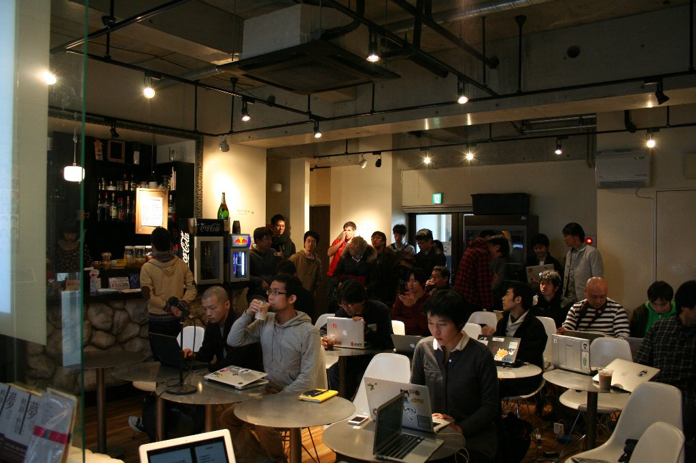
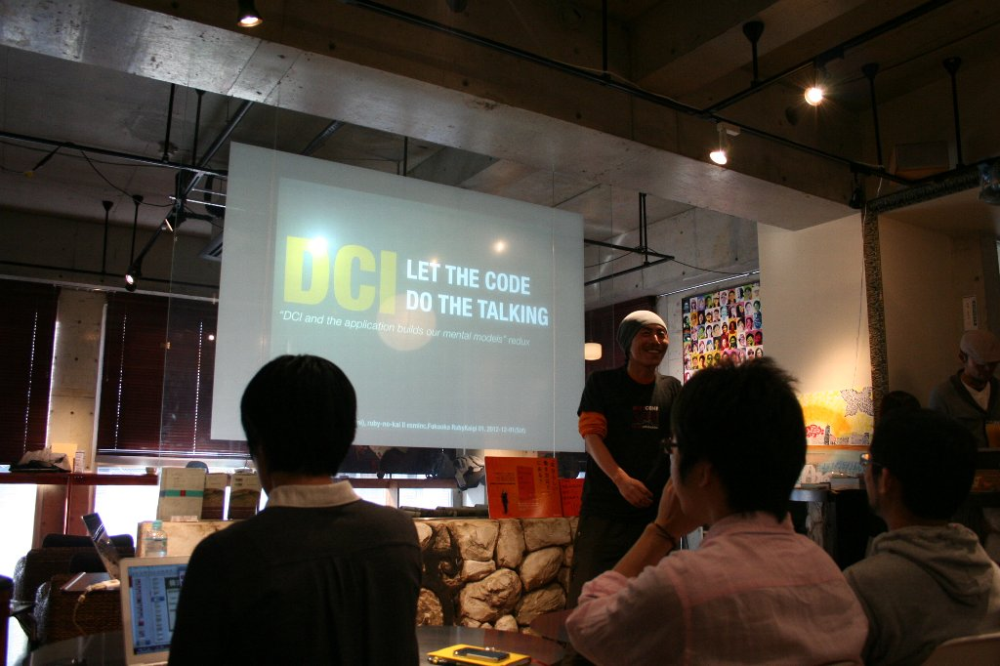

## はじめに

福岡でほぼ隔週で開催されている Fukuoka.rb のメンバーの @Spring\_MT が中心となって、福岡での Ruby 会議が開催されました。
福岡では 2008 年に「九州Ruby会議01」開催されていますが、それ以来 4 年ぶりの開催となりました。

### 開催日

2012年12月1日 14:00-18:00

### 開催場所

GuildCafe Costa

### 主催

@Spring\_MT

### 後援

日本Rubyの会、GaiaX、10xlab

### 公式タグ・ Twitter

\#fukuokark01

* [福岡Ruby会議のtweetまとめ](http://togetter.com/li/416276)

## DCI: Let the code do the talking (招待講演)
* 発表者
    * @kakutani
* 資料
    * [https://speakerdeck.com/kakutani/dci-let-the-code-do-the-talking](https://speakerdeck.com/kakutani/dci-let-the-code-do-the-talking)

\#RubyFriends の紹介に始まり、福岡ではなかなか聞くことが出来ない Ruby 界隈の最新事情を話していただきました。

ソフトウェアはどこにあるのか、という哲学的な問題提起に対し、「ソフトウェアは頭の中にあり、ソフトウェア開発とは、エンドユーザーのメンタルモデルをソースコードとして表現すること」と定義し、2012 年後半に Rails 界隈を賑わせた DCI についてお話しいただきました。

「Rails のほう向いて仕事しちゃいけせんよ、ユーザのほう向いてください」という言葉はとても心に響きました。

## Enumerator::Lazy の使いかた

* 発表者
    * @nagachika
* 資料
    * [https://speakerdeck.com/nagachika/dai-duo-narubyisthefalsedao-enumerator-lazy-falseshi-ikata-at-fu-gang-rubyhui-yi-01](https://speakerdeck.com/nagachika/dai-duo-narubyisthefalsedao-enumerator-lazy-falseshi-ikata-at-fu-gang-rubyhui-yi-01)

Ruby 2.0 の新機能紹介を [PB memo](http://d.hatena.ne.jp/nagachika/ "PB memo") の著者の @nagachika さんに行っていただきました。
Yokohama.rbで一度発表された内容に一部追加した内容の発表となりました。
会議当日はまだ Ruby 2.0 はリリース前で、Module#prepend や消えるかもしれなかった Refinements について説明していただきました。
メインの Enumerator::Lazy に関してはライブコーディング形式で解説していただきました。

## 初心者エンジニアのシステム構築失敗談

* 発表者
    * @Spring\_MT
* 資料
    * [http://www.slideshare.net/blueskyblue/ss-15438284](http://www.slideshare.net/blueskyblue/ss-15438284)

今やっているプロジェクトのアプリ構成の遷移のお話をしました。
これがベストではないとおもっていますが、チームの中で考えた今のベターな構成だと思ってます。
今回はユーザーの入力値のvalidationを行う場所としてcontrollerを選びましたが、ユーザーの入力値のvalidationがcontrollerの責務かというとちょっと違うかなあとも思います。
じゃあどこがベストなのと突っ込まれると答えられないですが。。。。
懇親会で、controllerでvalidationするというよりは、ユーザーの入力値のvalidationをARとは別に行い、validationを行う場所としてcontrollerを選んだというほうが良さそうとインプット頂き、確かにそうだなあと思います。

## Sencha Touchの本を書いたよ

* 発表者
    * @kis
* 資料
    * 発表資料はないですが、参考資料はこちら[Sencha TouchでのクロスドメインなJSONP通信](http://d.hatena.ne.jp/nowokay/20121203#1354560806)

@kis さんは会議直前に出版された Sencha Touch について。
スライドは事前に用意せず、その場でスライドを作っていく斬新なスタイルでした！
Sencha Touch でクロスドメイン通信をする話をしていただきました。

## Ruby 2.0 の Bitmap Marking GC って美味しいの？

* 発表者
    * @wats
* 資料
    * 

@wats さんも @nagachika さん同様に、Ruby 2.0 で導入された Bitmap Marking GC についてお話いただきました。
シンプルな Mark & Sweep 方式から Bitmap Marking GC へと変更されることで Unicorn や Passenger のメモリ消費量減少が見込まれることなどをお話しいただきました。

## LT

その後以下の8名の方にライトニングトークをしていただきました。

1. Hiroto Imoto - 新卒研修で初めてRails開発をしたときに感じた事
  * 資料 : [https://docs.google.com/presentation/pub?id=1JNSSZk4LlV8pHPQLtYVGNcFE-4LSqCzjZ4SDADSTsvU#slide=id.p](https://docs.google.com/presentation/pub?id=1JNSSZk4LlV8pHPQLtYVGNcFE-4LSqCzjZ4SDADSTsvU#slide=id.p)

  paperboy&co.さんで実際に行った研修の内容を紹介して頂きました。期限を守ってサービスをローンチすることをしっかりやることを

2. Koichi Saito - Rails高速化〜isuconを題材にして〜
  * 資料 : [https://docs.google.com/presentation/pub?id=1UC83Ja9T5Q_Y103GiiQamD6UILfqu290wj8T0CovJUQ#slide=id.p](https://docs.google.com/presentation/pub?id=1UC83Ja9T5Q_Y103GiiQamD6UILfqu290wj8T0CovJUQ#slide=id.p)

  2012年11月3日に行われた[isucon2](http://blog.livedoor.jp/techblog/archives/67693255.html)のアプリを題材にして、Railsの高速化に関するtipsを紹介して頂きました。

3. Manabu Matsuzaki - 仕事でRubyを使う為にやった事あれこれ
  * 資料 : [http://www.slideshare.net/matsumana0101/ruby01-20121201-lt](http://www.slideshare.net/matsumana0101/ruby01-20121201-lt)

  Rubyを会社で使っていくためのノウハウを紹介して頂きました。Rubyを使いたいけど色々なしがらみがあって使えない時は、少しづつRubyのプロダクトを使っていくのが良さそうですね。

4. @ayato\_p - JavaプログラマがRubyに惚れたら
  * 資料 : [https://speakerdeck.com/ayato0211/javapuroguramagarubynibu-retara](https://speakerdeck.com/ayato0211/javapuroguramagarubynibu-retara)

5. Shigeichiro Yamasaki - Rubyで フィジカル・コンピューティング
  * 資料 : [http://www.slideshare.net/11ro_yamasaki/fukuoka-rubykaigi01-yamasaki-lt](http://www.slideshare.net/11ro_yamasaki/fukuoka-rubykaigi01-yamasaki-lt)

  Rubyを使ってフィジカル コンピューティングを行った事例の紹介をして頂きました。 mrubyではなく、MRIを使ってるのがGCのタイミングをずらすなど、チューニングをやられていてRubyの違った側面が見れてとても参考になりました。

6. @kiwanami - 非Web系会社でのRuby適用事例いろいろ
  * 資料 : [http://www.slideshare.net/MasashiSakurai/webruby](http://www.slideshare.net/MasashiSakurai/webruby)

7. @yotii23 - RailsGirlsと手榴弾とわたし
  * 資料 : [https://speakerdeck.com/yotii23/railsgirlstoshou-liu-dan-towatasi](https://speakerdeck.com/yotii23/railsgirlstoshou-liu-dan-towatasi)

  東京で開催されたRailsGirlsの紹介をして頂きました。

8. @kazuph - みんなでProjectEuler in Ruby
  * 資料 : [http://kazuph.github.com/presentation/fukuoka_ruby_kaigi/#/](http://kazuph.github.com/presentation/fukuoka_ruby_kaigi/#/)

  Gaiaxで取り組んでいるProjectEulerについて紹介して頂きました。

## さいごに
福岡の人の発表が多く、また様々な分野の方に発表して頂けたこともあり、色々なRubyの使い方が紹介されました。
Fukuoka.rbではRailsの話題が多く出ていたこともあり、Railsの発表がかなり多くなるのではと思っていたのですが、いい意味で予想が裏切られた形になり、福岡ならではのRegionalRubyKaigiになったのではないかと思います。

本当にさいごですが、
福岡Ruby会議01の参加者の皆様に百万の感謝を
Thanks a million for all Fukuoka regional ruby kaigi participants !
