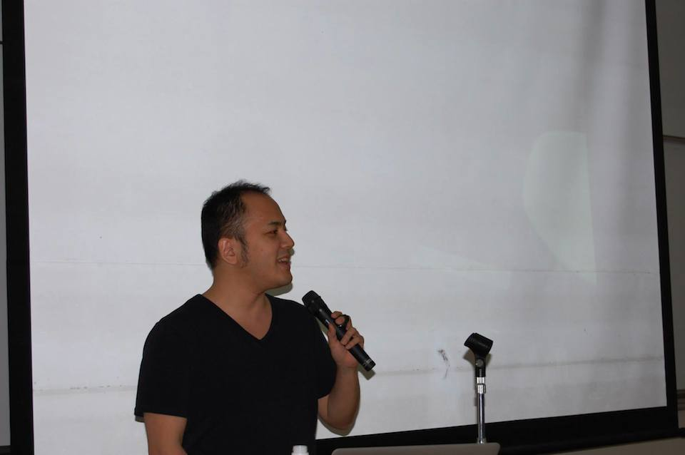

##はじめに

沖縄で毎週開催されている Okinawa.rb の発起人である @yasulab さんが中心となって、沖縄初の「沖縄Ruby会議01」が開催されました。

## 開催日

2013年3月1日 13:00-18:00

## 開催場所

琉球大学 工学部１号館 大教室 322 (本会場) & 321 (サテライト会場)

## 主催

## 協力

日本Rubyの会、ギークハウス沖縄、株式会社レキサス、特定非営利活動法人軽量Rubyフォーラム、ウェブペイ株式会社

## 公式タグ・Twitter

\#okrk01

* [沖縄Ruby会議のtweetまとめ](http://togetter.com/li/636273)

## ゲスト講演②

### 「Rubyを使って3人/日でアプリをリリースしよう」

* 発表者
    * [@masuidrive](https://twitter.com/masudrive)
* 資料
    * なし

風呂グラマーとして有名な@masuidriveさんには、[wri.pe](https://wri.pe/)を作っていくプロセス、リリースした後の運用部分などのお話を伺いました。自分が普段使えるものを作ろうと、3日では基本的なメモアプリの機能実装を行ったそうです。プレスを打つなど、運用、顧客対応、いろんなものがすごく広い範囲で見ることができ、何か小さなものでもいいからプロダクトを作ってみることを薦めていました。

## Lightning Talks 1 + Sponsored Session

### 「Rubyによるバッチ業務のストリーム処理化の設計と実装」@bash0C

* 発表者
    * [@bash0C7](https://twitter.com/bash0C7)
* 資料
    * [Rubyによるバッチ業務のストリーム処理化の設計と実装](https://speakerdeck.com/bash0c7/design-and-implement-batch-stream-processing-application-for-ruby)

ログ収集ツールとして注目される[fluentd](http://fluentd.org)を使いストリームにバッチ業務を処理する手法を紹介して頂きました。
通常はログ収集のみにつかわれることが多いfluentdですが、入出力のプラグインを自作することで解析されたwebストリームを受けて進捗確認のツールとして使用することが出来るそうです。
プラグインは[RubyGem](https://www.ruby-lang.org/ja/libraries/)の形式で導入することが出来るため、手軽に機能を追加する出来るということをおっしゃていました。  

### 「Emacsの普通の使い方」@libkinjo

* 発表者
    * [@libkinjo](https://twitter.com/libkinjo)
* 資料
    * [Emacsの普通の使い方](http://kinjo.github.io/okrk01/#/title)

Rubyではirbやpryを使って対話式にプログラムを記述することが出来ますが、libkinjoさんはEmacsのscratchバッファでeLispと対話するようにRubyとも対話したいと考えました。
comint.elとinf-ruby.elを使いEmacsバッファ内でRubyのコードを実行し結果を受け取るデモを実際に動かして頂きました。
また「scratchバッファはEmacsと対話する聖域（サンクチュアリ）」や「Emacsはロマンの積み木」などカッコいい名言で会場を盛り上げて頂きました。  

###「RyukyuFrogsとLexues Academyの話」株式会社レキサス

* 発表者
    * 山崎さん[株式会社レキサス](http://lexues.co.jp)

沖縄県内の学生を育成するプロジェクト[RyukyuFrogs](http://www.ryukyu-frogs.com)と[Lexues Academy](http://academy.lexues.co.jp)の紹介でした。

## 沖縄県内のコミュニティ活動の紹介

動画: [県内コミュニティ活動の紹介 (各3分〜5分)](http://www.ustream.tv/recorded/44349362)

沖縄のRubyコミュニティだけでなく、県内で活動するコミュニティ紹介のLTも行いました。
ものづくりのコミュニティから、エンジニアの集うシェアハウスまでの計5つのコミュニティの発表を行いました。

### Ryukyu Rubyist Rookies
[@repserc](https://twitter.com/repserc)さんによる[Ryukyu Rubyist Rookies](https://www.facebook.com/groups/ruby.okinawa/)の紹介でした。(発表資料: [Ryukyu Rubyist Rookies 紹介 @ 沖縄Ruby会議01](http://www.slideshare.net/repserc/ryukyu-rubyist-rookies))

「最終的な目標として"Good bye blue monday"、月曜日をRubyで楽しく過ごして行きましょう!」とおっしゃっていたのが印象的でした。
Rubyの初心者、プログラミング初心者が多いのが特徴で、「ベーマガ/Cマガみたいなお題をつくっていきたい」「初心者から中級者へ」と互いに教えあっている様子を紹介してくださいました。

後日、[沖縄Ruby会議で発表できなかったこと](http://repserc.hatenablog.com/entry/2014/03/04/164535)を教えていただきました。

### Ryudai.rb
[@_simanman](https://twitter.com/_simanman)さんによる[ryudai.rb](http://lingr.com/room/ryudairb)の紹介でした。

沖縄Ruby会議01の日がちょうど設立1周年。コミュニティの維持についての悩みを話していました。

### Okinawa.rb
[@yasulab](https://twitter.com/yasulab)さんによる[Okinawa.rb](https://www.facebook.com/groups/okinawarb/)の紹介でした。

毎週水曜日の夜、ギークハウス沖縄で行われているWeekly Meetupの様子と、ハッカソン、台風そん(台風の暴風域に入ってから抜けるまでの間行われているハッカソン、基本的に家で一人で行うのでエクストリーム・ボッチソンともいう)の様子を紹介していただきました。

Okinawa.rbでは毎週水曜日Weekly Meetupを開催しているので、沖縄へお越しの際はぜひご参加ください :) (参考: [那覇空港からギークハウス沖縄までの行き方](https://speakerdeck.com/yasulab/na-ba-kong-gang-karagikuhausuchong-nawa-madefalsexing-kifang))

### ハッカーズチャンプルー
沖縄県内IT系コミュニティの夏祭り、[ハッカーズチャンプルー](http://hackers-champloo.org/)について、[@k_nishijima](https://twitter.com/k_nishijima)さんに発表&告知して頂きました。(発表資料: [20140301ハッカーズチャンプルー告知lt](http://www.slideshare.net/KoichiroNishijima/20140301lt)、ブログ: [K Nishijimaのぶろぐ: 沖縄Ruby会議とMusic Atlas 2014に行ってきました](http://k-nishijima.blogspot.jp/2014/03/rubymusic-atlas-2014.html))

その場でMatzさん、増井さんに「また沖縄きたいですか?どうですか!?」と呼びかけ、OK(仮)をもらって盛り上がっていました。
ハッカーズチャンプルーは今年(2014年)7/18〜7/19に開催されるようです。

### gFab
又吉さんから、ものづくりコミュニティgFabの紹介でした。
楽しく作るデジタルファブリケーションの場、ということで、台風で吹き飛ばされてしまった看板を作りなおしたご自身の体験などを紹介していました。
「メーカーブームに乗ってレーザーカッターや、3Dプリンター買っちゃった、どうしよう」と困っているかたは、gFabのようなコミュニティをはじめてみると面白くなるかもしれませんね!

### ギークハウス沖縄 @kimihito_
[@kimihito_](https://twitter.com/kimihito_)さんによるギークハウス沖縄の紹介では、全国におよそ17ヶ所ある[ギークハウス](http://geekhouse.tumblr.com/)の説明と、[ギークハウス沖縄](http://text.geeoki.com/)の活動のお話していただきました。Okinawa.rbの毎週のMeetupの会場になっていたり、Rubyでロボットの操作ができるフレームワークである[Artoo](http://artoo.io/)を使ってRubyでARDroneを飛ばしたりなど、部室のような空気が残るギークハウス沖縄の紹介でした。

## Lightning Talks 2

### 「rcairoでものづくり」@mgwsuzuki

* 発表者
    * [@mgwsuzuki](https://twitter.com/mgwsuzuki)
* 資料
    * [rcairoでものづくり](http://www.slideshare.net/mgwsuzuki/ruby-kaigi-rcairo)

2Dグラフィックス用のCライブラリである[cairo](http://cairographics.org/)をRubyでバインディングした[rcairo](https://github.com/rcairo/rcairo)を使って、自動設計するプログラムをRubyで作成、1時間20分ほどで完成することができたそうです。今後はGithubに自動設計のプログラム公開し、パラメータをPull Requestすることで簡単にハコを作れるようにしたいということをおっしゃっていました。

### 「Rubyに何かをしゃべらせる」Yoichi Kobayashi

* 発表者
    * [Yoichi Kobayashi](http://www.linkedin.com/pub/yoichi-kobayashi/89/205/461)
* 資料
    * なし

[Twilio](http://www.twilio.com/)とRubyを使って、ただひたすらオヤジギャクを喋らせる番号を取得したが、喋るオヤジギャクが本当に面白いものなのかというのをどう判定するかのアルゴリズムをRubyで考えたいというようなお話でした。オヤジギャクを扱いながらも、何をもって面白いのかを真面目に考察する発表に会場からは笑いが起こっていました。

### 「組み込みにもiOSにもrubyで幸せ（仮）」@shumach217

* 発表者
    * [@shumach217](https://twitter.com/shumach217)
* 資料
    * [組み込みにもiOSにもrubyで幸せ（仮）](http://www.slideshare.net/shumach217/ruby01-31912722)

組み込みで行われる実機テストを、手作業からRSpecとturnipを使った自動化に変更したお話から、iOSの開発においても同様なアプローチができるのではないかと考え、turnipを記述でiOSのデバイスをリモート操作できるようなテストフレームワークを作成中であるとおっしゃっていました

## Lightning Talks 2.5 + Sponsored Session

### 「きたのくにからこんにちぬー！」

* 発表者
    * [@PUPRL](https://twitter.com/PUPRL)
* 資料
    * [きたのくにからこんにちぬー](http://www.slideshare.net/AsamiImazu/okrk01-kitanokunikarakonnnichinu)

北海道からお越しの[@PUPRL](https://twitter.com/PUPRL)さんは、「和室でぬるくRubyをもくもくする」[ぬRuby](http://nuruby.org/)という活動の紹介の地域Rubyに参加することの良さについて語ってくださいました。はじめてのLTであったにも関わらず、ぬRubyの魅力がしっかり伝わったようで、LT後にはぬRubyに参加したいとの言葉をたくさん見受けることができました。

### 「The Payment System by Ruby」ウェブペイ株式会社

* 発表者
    * [@sowawa](https://twitter.com/sowawa)
* 資料
    * なし

開発者向けのクレジット決済サービスの[WebPay](https://webpay.jp/)を開発しているウェブペイ株式会社のスポンサーセッションでは、Rubyでセキュアなプログラミングを行う際の注意点をお話してくださりました。シンボルはGCされない問題があり、ユーザ入力をto_symすると問題が起きてしまうという例を取り上げ、シンボルの扱いに関してのお話がありました。5分という短いセッションながらも内容の濃いお話でした。

## Lightning Talks 学生枠

### 「This is a SharePla」

* 発表者
    * [@kanpe777](https://twitter.com/kanpe777) [@salvare234](https://twitter.com/salvare234)
    * [RyuPiT](https://github.com/RyuPiT)

旅のプランをネット上で共有出来るWebアプリケーション[SharePla](http://sharepla.herokuapp.com)を紹介しました。
人材育成イベントの一環でアジャイル開発のスクラムを実践したらしく、実際にどのようにWebアプリケーションを開発していったかを話していました。
Web上にも公開していて実用したユーザのフィードバックを受けて開発を続けていきたいと話していました。  

### 「琉大図書館にRuby本を！」

* 発表者
    * [@_simanman](https://twitter.com/_simanman)
* 資料
    * [琉大図書館にRuby本を！](http://www.slideshare.net/_siman/ruby-31905851?qid=8ca58c70-4301-47df-b498-d2daa3e917c4&v=qf1&b=&from_search=1)

琉球大学図書館の選書システムを自動で入力する自作スクリプトについて紹介しました。プレゼンが可愛い棒人間で書かれていて目で見て面白いLTでした。  

### 「#MacFriends: Macの背面にステッカーを貼るヤツちょっとこい」

* 発表者
    * [@enkw_](https://twitter.com/enkw_)
* 資料
    * [#MacFriends: Macの背面にステッカーを貼るヤツちょっとこい](https://speakerdeck.com/enkw/number-macfriends-in-okinawa-ruby-kaigi)

[enkw_](https://twitter.com/enkw_)さんはMac Bookの背面をシェアするユニークなサービス[Mac Frends](http://macfriends.net)を紹介しました。
[RubyFriends](http://rubyfriends.com)から着想を得て作成したらしいです。会場ではさっそく利用している方の姿もありました。  

### 「Square your Instagram」@nanophate

* 発表者
    * [@nanophate](https://twitter.com/nanophate)

[instag](http://instag.herokuapp.com)は美術館のように洗練されたデザインで写真を閲覧することのできるサービスです。
開発をおこなった[nanophate](https://twitter.com/nanophate)さんは従来の写真公開サービスを見て「いいね」や「スター」などに邪魔されず、もっとユーザーが写真に没頭できるようなデザインのがほしいと思ったそうです。
画像は[instagram](http://instagram.com)の[API](http://instagram.com/developer/)を使って取得していてサービス名もそこから来ているらしいです。

### 「Rubyがモデリングをする時代」

* 発表者
    * [@motikan2010](https://twitter.com/motikan2010)

手軽に世界に一つだけのものを作れるサービス[Once-Tech](http://once-tech.net)について[motikan2010](https://twitter.com/motikan2010)さんが紹介しました。
既存の3Dモデルとユーザーがアップロードした画像を組み合わせることで自分だけの3Dモデルが作れるそうです。
発表で実際にサービスを利用してオリジナルの3Dモデルを作成するデモを行っていましたが数十秒ほどで3Dモデルが完成し、本当に手軽に利用することが可能でした。  

## ゲスト講演③

### 「mrubyを使うポイント」

* 発表者
    * [田中 和明 准教授](http://www.kyutech.ac.jp/professors/iizuka/i4/i4-2/entry-714.html)

2012年4月にgithubにコードが公開されて以来オープンソースでの開発がすすむ軽量rubyこと[mruby](https://github.com/mruby/mruby)。
そのmrubyを使うポイントについて九州工業大学で教鞭をとる田中和明准教授さんが講談しました。  

田中さんは大学卒業後、工業系の大学へ就職した田中さんはロボット制御など組み込み開発を行っていたそうです。
組み込み開発では主にCが常用されていますが、Rubyの方がコードを書きやすいのはCでプログラムを書いたことがある方ならすぐに分かりますね。
mrubyは当初から組み込みシステムに組み込みことを目的にスタートしたRubyです。  
Rubyの実行速度は遅いと言われていますが速ければいいわけではなく、一定時間内に処理が完了することを保証するリアルタイム性を満たすことができれば組み込みシステム開発で軽量化したRubyを使ってコードを書くことができます。
Rubyの強みであるGCを使ってメモリ管理をすることが可能で、GCの処理を一定時間以内に作業を完了することを保証するインクリメンタルGCを採用することでリアルタイム性を保証しているらしいです。

大きな強みとしてあげられるのがmrubyはVMプログラム上で動作するということでした。
mrubyのコードはRIteBinaryと呼ばれるバイトコードに変換され、書くハードウェアで動作するVMプログラムへ渡すことでプログラムを実行されます。
そのため、一度VMプログラムを作ってしまえば、PC上で動作するmrubyプログラムもマイコン上で動作するmrubyプログラムも全く同じコードで動かすことが出来ます。

また田中さんが大学で行っている研究としてmrubyに特化したハードウェアの開発の紹介がありました。
研究の例としてmrubyのメソッド呼び出し時に頻繁に使われるハッシュ関数をLSIチップ上で実装し、文字列操作を行うプログラムの性能を20%上昇させることに成功したらしいです。
